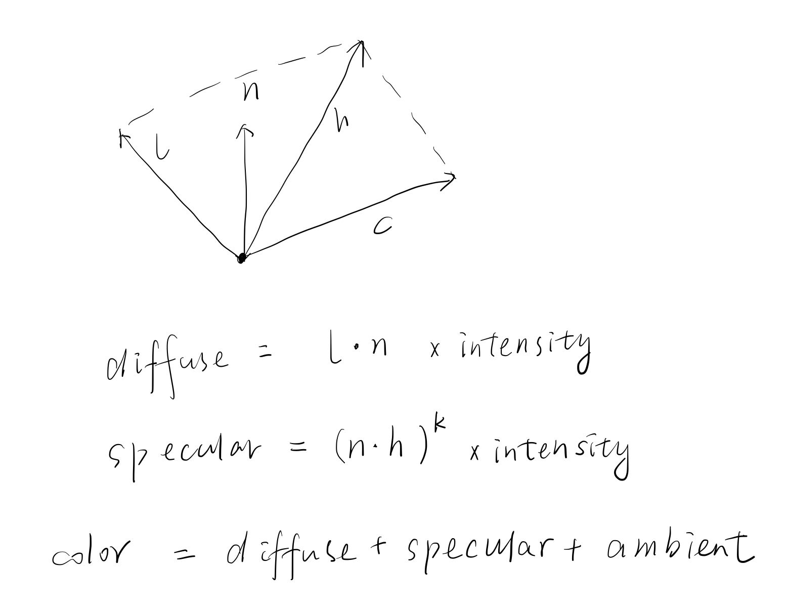
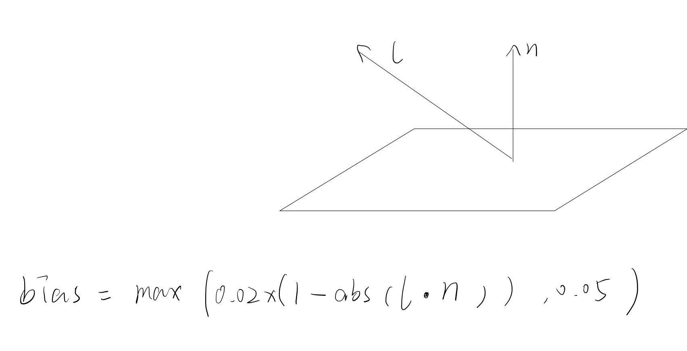
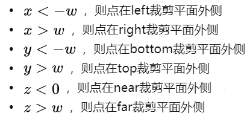

# SoftRenderer

## main的流程

1. 开辟窗口
2. 相机和光源确定位置和方向
3. 初始化材质
4. 初始化*phong shader*的参数
5. 初始化光照空间的depthBuffer
6. 读取*obj*文件数据，创建物体和平面
7. *tick*渲染

## 相机part

1. 相机变换
   1. 给定的参数为：相机位置，看的方向，向上的轴
   2. 得到旋转的角度`rightDir = Cross(upAxis,lookDir) , upDir = Cross(lookDir,rightDir) , lookDir = lookat`
   3. `mvp`变换到相机空间
2. 透视投影，正交投影矩阵：带公式

## 光源part

1. 平行光
   1. 成员数据：光源，方向，强度，着色方式
   2. 光源变换：变换到光源空间（方法同相机变换）
2. 点光源
   1. 成员数据：光强，光源

## 材质part

1. 材质的导入
   1. 获取bitmap
   2. 逐像素颜色存储到二维数组
2. 采样，根据uv获取颜色信息
   1. 根据uv参数取到数组中对应像素的颜色

## 着色part

### Phong shader

1. 顶点着色器

   1. 将顶点，法线变换到世界坐标
   2. 初始化漫反射系数，镜面系数，环境光系数
   3. 根据平行光/点光源计算Phong模型顶点的颜色

2. 片元着色器（传入顶点和重心坐标）

   1. 顶点颜色*=材质对应uv颜色

   2. 计算光照坐标系下的法线和位置

   3. 计算bias（用于解决阴影断层问题）

   4. 计算阴影

      1. 普通阴影：判断像素点(x,y)到光源的深度是否大于该点在光源坐标系下的数值

         ```cpp
         float closestdepth = frag.depthbuffer->sample(poslightspace.y, poslightspace.x);
         shadow = depth - bias > closestdepth ? 1 : 0;
         ```

      2. PCF:和周围像素取一个平均

         ~~~cpp
         	for (int x = -10; x <= 10; ++x)
         	{
         		for (int y = -10; y <= 10; ++y)
         		{
         			float pcfDepth = frag.depthBuffer->Sample(posLightSpace.y+y, posLightSpace.x+x);
         			shadow += depth - bias > pcfDepth ? 1.0 : 0.0;
         		}
         	}
         	shadow /= 400;
         ~~~

   5. 根据阴影返回最终颜色

## 网格体part

1. 成员数据：顶点，位置，法线，uv，索引
2. 模型变换
3. 添加顶点数据

## 渲染part

1. 成员数据：屏幕长宽；材质；光源；相机

2. 绘制mesh方法：

   1. 根据索引/数组创建：存入vertex信息后绘制三角形

3. 绘制三角形方法：

   1. 找到屏幕上的像素坐标

      ~~~cpp
      float reciprocalW = 1.0f / vertex.pos.w;
      	//最后加0.5是为了后面取证做四舍五入
      	vertex.pos.x = (vertex.pos.x * reciprocalW + 1.0f) * 0.5f * (buffer->width - 1) + 0.5;
      	vertex.pos.y = (vertex.pos.y * reciprocalW + 1.0f) * 0.5f * (buffer->height - 1) + 0.5;
      ~~~

   2. 拆分为一个平顶三角形和一个平底三角形，插值找到分界点的信息，分别绘制两个三角形：从每一行的[xl,xr]从左到右画线
   3. 画线步骤：只考虑x方向扫描线：对于每个像素，通过了ztest，将它的颜色，uv计算出来，根据重心得出该像素在三角形中，就对该像素上色
   4. CVV剔除
